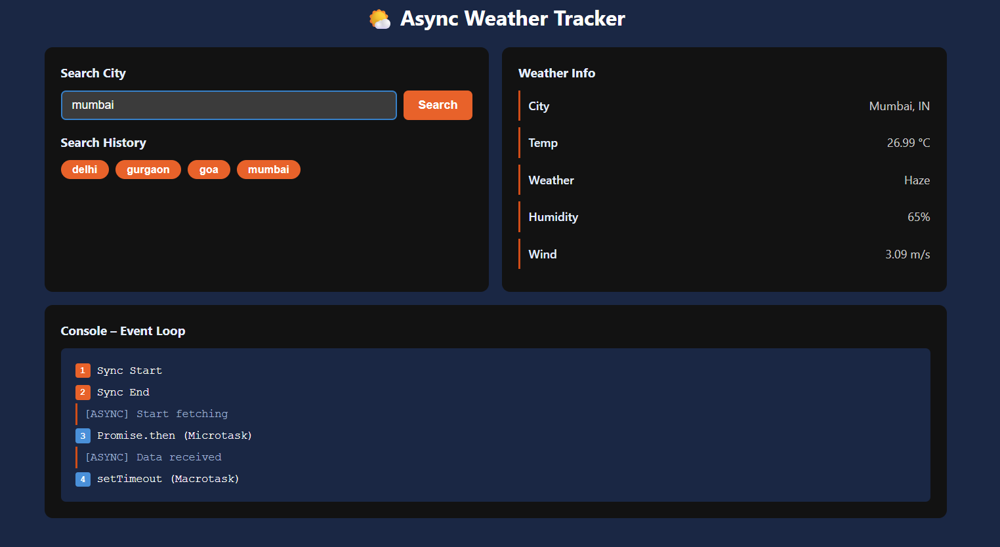

# 🌤 Async Weather Tracker

This project is a simple web application built using **HTML, CSS, and Vanilla JavaScript** to demonstrate **asynchronous JavaScript concepts** such as `fetch()`, `async/await`, `Promises`, and the **JavaScript Event Loop**.

The application allows users to search for a city and view its current weather information using the **OpenWeatherMap API**.

---

## 📷 Project Preview


## 📌 Features

* Search weather by city name
* Fetch real-time weather data using **Fetch API**
* Uses **async/await** for asynchronous operations
* Demonstrates **Promise.then() (Microtask Queue)**
* Demonstrates **setTimeout() (Macrotask Queue)**
* Shows **Event Loop execution order**
* Saves searched cities in **LocalStorage**
* Clickable **Search History buttons**
* Responsive UI built with **pure CSS**

---

## 🧠 Concepts Demonstrated

This project demonstrates topics from **Unit 1 and Unit 2** of Web Development:

### DOM Manipulation

* `querySelector()`
* `addEventListener()`
* `createElement()`
* `appendChild()`
* `innerHTML`

### Asynchronous JavaScript

* `fetch()` API
* `async / await`
* `Promise.then()`
* `setTimeout()`
* `try...catch` error handling
* JavaScript **Event Loop**

### Browser Storage

* `localStorage`

---

## 📷 Application Layout

The application interface contains:

* **Search City Panel**
* **Weather Information Panel**
* **Console – Event Loop Panel**
* **Search History Buttons**

---

## ⚙️ Technologies Used

* HTML5
* CSS3
* Vanilla JavaScript
* OpenWeatherMap API

---

## 🚀 How to Run the Project

1. Clone the repository

```
git clone https://github.com/garudasec/async-weather-tracker-webdev.git
```

2. Open the project folder

3. Run the project by opening:

```
index.html
```

in your browser.

---

## 📡 API Used

Weather data is fetched from:

**OpenWeatherMap API**

https://openweathermap.org/api

---
